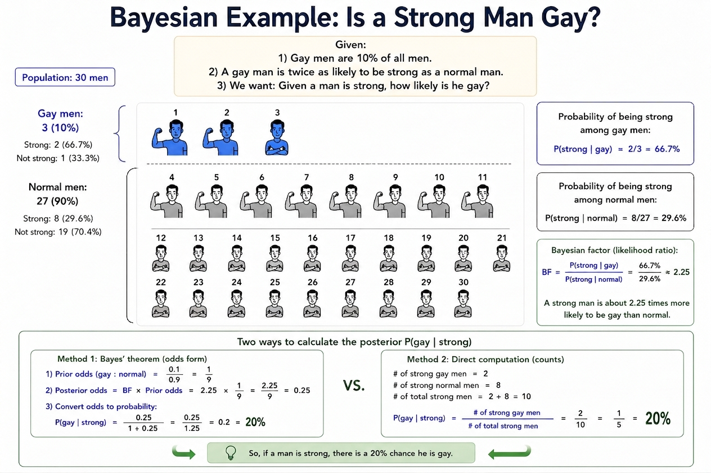

## 核心公式

贝叶斯定理描述了如何根据新证据更新我们的信念[^1][^2]：

$$
P(H|D) = \frac{P(D|H) \times P(H)}{P(D)}
$$

其中：

- **H**是你想预测的变量
- **P(H)**：先验概率（观察证据前的信念）
- **P(D|H)**：似然函数（反过来，现在已经告诉你结果，假设成立时观察到证据的概率）
- **P(H|D)**：后验概率（观察证据后更新的信念）
- **P(D)**：边际概率（证据的总概率）

## 贝叶斯因子：更直观的假设比较

贝叶斯因子（Bayes Factor）是两个假设的比，也就是所谓的**似然比**：

$$
BF_{12} = \frac{P(D|H_1)}{P(D|H_2)}
$$

**关键洞察**：后验赔率可以通过先验赔率乘以贝叶斯因子得到，无需计算全概率 P(D)：

$$
\frac{P(H_1|D)}{P(H_2|D)} = \frac{P(H_1)}{P(H_2)} \times BF_{12}
$$

## 例子一：Gay问题

### 已知条件

- Gay占所有男人的 **10%**
- Gay是肌肉男的概率是普通男人的 **2.25倍**

### 具体数据（30人样本）

| 类别 | 人数 | 肌肉男人数 | 肌肉男概率 |
|------|------|----------|----------|
| Gay | 3人 | 2人 | **66.7%** |
| 普通男人 | 27人 | 8人 | **29.6%** |

### 贝叶斯推理过程

**问题**：当我们观察到一个肌肉男时，他是Gay的概率是多少？

**计算方法一：直接数人头**

$$
P(\text{Gay}|\text{肌肉男}) = \frac{\text{Gay的肌肉男}}{\text{肌肉男总数}} = \frac{2}{10} = 20\%
$$

**计算方法二：贝叶斯公式**

已知：

- $P(\text{Gay}) = 10\% = 0.1$（先验概率）
- $P(\text{肌肉男}|\text{Gay}) = \frac{2}{3} = 66.7\%$（Gay中肌肉男的概率）
- $P(\text{肌肉男}|\text{普通}) = \frac{8}{27} = 29.6\%$（普通男人中肌肉男的概率）

计算全概率 $P(\text{D})$，也叫归一化参数：

$$
P(\text{肌肉男}) = P(\text{肌肉男}|\text{Gay}) \times P(\text{Gay}) + P(\text{肌肉男}|\text{普通}) \times P(\text{普通})
$$

$$
= \frac{2}{3} \times 0.1 + \frac{8}{27} \times 0.9 = \frac{2}{30} + \frac{7.2}{27}  = \frac{1}{3}
$$

此处相当于加权汇总，肌肉男的出现平均机会是1/3。

代入贝叶斯公式：

$$
P(\text{Gay}|\text{肌肉男}) = \frac{P(\text{肌肉男}|\text{Gay}) \times P(\text{Gay})}{P(\text{肌肉男})} = \frac{\frac{2}{3} \times 0.1}{\frac{1}{3}} = 20\%
$$

**计算方法三：贝叶斯因子**

$$
LR = \frac{P(\text{肌肉男}|\text{Gay})}{P(\text{肌肉男}|\text{普通})} = \frac{66.7\%}{29.6\%} = 2.25
$$

后验赔率计算：

$$
\frac{1}{9} \times 2.25=\frac{1}{4}
$$

1：4对应的概率就是1/5，也就是20%

## 关键洞察：概率的相对变化

| 概率类型 | 值 | 说明 |
|----------|-----|------|
| 先验概率 $P(\text{Gay})$  | **10%** | 观察前的信念 |
| 后验概率 $P(\text{Gay} \mid \text{肌肉男})$ | **20%** | 观察到肌肉男后的更新 |

### 贝叶斯更新的意义

1. **概率翻倍**：从10%提升到20%，"肌肉男"证据让Gay的可能性**提升了2倍**
2. **基数效应**：由于Gay本身很少（10%），即使后验概率翻倍，绝对值仍然不高

## 避免基础率谬误

这个例子展示了**基础率谬误**（Base Rate Fallacy）：

- **错误思维**：Gay里面肌肉男概率高（66.7%），所以肌肉男很可能是Gay
- **正确思维**：虽然Gay里面肌肉男概率高，但Gay基数太小，所以肌肉男中Gay比例仍然较低

## 例子二：安全带

上一个例子，我们是想通过肌肉这个证据，来助力判断Gay or not。现在第二个例子，我们想通过安全带这个证据，对交通意外事故后判断他死不死是否有帮助。

我们想知道的是Given系安全带，发生意外后幸存概率如何被更新。

也就是求P(Survival | Seatbelt)

但是显然，反过来的数据更容易观察，也就是P（Seatbelt| Survival)或者是P（Seatbelt| Death)，Survival or death就是$H_S$和 $H_D$

### 似然比：NHTSA 交通事故终局与安全带数据[^3]

|                | 死亡 $H_D$ | 幸存 $H_S$ |
| -------------- | -------: | -------: |
| 系安全带 $S$       |      50% |      86% |
| 不系安全带 $\neg S$ |      50% |      14% |

用上前面的**贝叶斯因子／似然比**：

$$
LR_S = \frac{P(S|H_D)}{P(S|H_S)} = \frac{0.50}{0.86} \approx 0.58
$$

带安全带把死亡的Odds**降低**近一半。

$$
LR_{\neg S} = \frac{P(\neg S|H_D)}{P(\neg S|H_S)} = \frac{0.50}{0.14} \approx 3.57
$$

当观察到不系安全带，死亡的Odds**增加**3.57倍。

因为人只有系安全带，和不系安全带两个结果，观察到一个证据，必然同时管察到另外一个。不像做检查，阳性结果，阴性结果，和不做检查可以有3个状态，安全带也不能系一半。两个证据一个是增加，一个减少，他们的出入相差了6.14倍

$$
\frac{LR_{\neg S}}{LR_S} = \frac{3.57}{0.58} \approx 6.14
$$

$$
\text{Posterior Odds} = \text{Prior Odds} \times LR
$$

例：先验死亡率 $P(H_D)=10\%$，Prior Odds $=\frac{0.1}{0.9}=0.111$，看到「系了安全带」：

$$
0.111 \times 0.58 = 0.0644 \;\Rightarrow\; P(H_D|S) \approx 6.05\%
$$

看到「没有系安全带」：

$$
0.111 \times 3.57 = 0.396 \;\Rightarrow\; P(H_D|\neg S) = \frac{0.396}{1+0.396} \approx 28.4\%
$$

不系安全带把死亡率从 10% 推高到约 28.4%，是系安全带（6.05%）的 4.7 倍。

### 常见误读

- **「死亡者里 50% 系了安全带」≠ 安全带无效**：前者只是 $P(S|H_D)$与$P(\neg S|H_D)$（表格上下格比较）；判断是否有效要比 $P(H_D|S)$ 与 $P(H_D|\neg S)$（表格左右格比较）

## 例子三：罕见病筛查与假阳性

第三个例子换到医学场景：乳腺癌是**罕见病**，而检查手段（如钼靶）已经很准——不仅灵敏度高，**假阳性率也很低**。问题是：检查结果呈阳性，真的得病了吗？

也就是求 $P(H_{患癌}|\text{阳性})$。**这又被称为PPV（Positive Predictive Value，阳性预测值）**：检查阳性时真的患病的概率。

### 已知条件

- 乳腺癌发病率（先验）：$P(H_{患癌}) = 1\%$
- **灵敏度Sensitivity**：$P(\text{阳性}|H_{患癌}) = 90\%$
- 假阳性率很低：$P(\text{阳性}|H_{未患癌}) = 5\%$（**特异度Specificity** 95%）

### 1000 人样本

| D证据（信息量)    | $H_{患癌}$ | $H_{未患癌}$ |
| ----------- | -------: | --------: |
| 检查阳性 $+$    |       9人 |       50人 |
| 检查阴性 $-$    |       1人 |      940人 |
| **总人数（先验）** |  **10人** |  **990人** |

按列转成百分比：

| D证据（信息量)   | $H_{患癌}$ | $H_{未患癌}$ |
| ---------- | -------: | --------: |
| 检查阳性 $+$   |      90% |        5% |
| 检查阴性 $-$   |      10% |       95% |
| **占比（先验）** |   **1%** |   **99%** |

### 贝叶斯推理过程

**计算方法一：直接数人头**

$$
P(H_{患癌}|\text{阳性}) = \frac{\text{阳性且患癌}}{\text{阳性总人数}} = \frac{9}{59} \approx 15.3\%
$$

**计算方法二：贝叶斯公式**

计算全概率（归一化参数）：

$$
P(\text{阳性}) = 0.9 \times 0.01 + 0.05 \times 0.99 = 0.009 + 0.0495 = 0.0585
$$

代入：

$$
P(H_{患癌}|\text{阳性}) = \frac{0.009}{0.0585} \approx 15.4\%
$$

**计算方法三：贝叶斯因子**

**阳性**结果的似然比：

$$
LR_+ = \frac{P(\text{阳性}|H_{患癌})}{P(\text{阳性}|H_{未患癌})} = \frac{0.90}{0.05} = 18
$$

先验赔率 $\frac{10}{990} = 0.0101$，乘以 18：

$$
0.0101 \times 18 = 0.182 \;\Rightarrow\; P(H_{患癌}|\text{阳性}) = \frac{0.182}{1+0.182} \approx 15.4\%
$$

**阴性**结果的似然比：

$$
LR_- = \frac{P(\text{阴性}|H_{患癌})}{P(\text{阴性}|H_{未患癌})} = \frac{0.10}{0.95} \approx 0.105
$$

压缩到原来的 0.105：

$$
0.0101 \times 0.105 = 0.00106 \;\Rightarrow\; P(H_{患癌}|\text{阴性}) = \frac{0.00106}{1+0.00106} \approx 0.1\%
$$

两个证据方向相反，一升一降相差约 171 倍：

$$
\frac{LR_+}{LR_-} = \frac{18}{0.105} \approx 171
$$

### 关键洞察

- **阳性 ≠ 确诊**：即使假阳性率只有 5%，因为 $H_{未患癌}$ 的基数（990人）远大于 $H_{患癌}$（10人），假阳性的**绝对数量**（50人）仍远超真阳性（9人），阳性预测值只有约 15%
- **阴性很可靠**：$LR_- = \frac{0.10}{0.95} \approx 0.105$，阴性结果把 $H_{患癌}$ 的赔率压到原来的 1/10，后验概率约 0.1%，可以基本排除
- 这正是**基础率谬误**的又一次体现：再低的假阳性率，在罕见病面前都会被庞大的健康人群放大

### 附：阴性预测值

**NPV（Negative Predictive Value，阴性预测值）**：检查阴性时确实未患癌的概率

先算全概率：

$$
P(\text{阴性}) = 0.10 \times 0.01 + 0.95 \times 0.99 = 0.001 + 0.9405 = 0.941
$$

代入：

$$
NPV = P(H_{未患癌}|\text{阴性}) = \frac{P(\text{阴性}|H_{未患癌}) \times P(H_{未患癌})}{P(\text{阴性})} = \frac{0.95 \times 0.99}{0.941} \approx 99.9\%
$$

- **PPV 低、NPV 高**：阳性结果只意味着「值得进一步检查」（约 15%），阴性结果则可基本放心（约 99.9%）
- 若直接用表格数人头：$NPV = \frac{940}{941} \approx 99.9\%$

### 番外：

当我们把敏感度和特异度放在上述的例子里面

| 预测目标       | Sensitivity | Specificity |
| ---------- | ----------: | ----------: |
| 不系安全带 → 死亡 |         50% |         86% |
| 系安全带 → 幸存  |         86% |         50% |
| 肌肉男 → Gay  |       66.7% |       71.4% |

- **Sensitivity敏感度**就是特征值是否在该（预测/标签的人群/假设）中普遍存在，Gay里面肌肉男的普遍程度越高，敏感度就越高，在这么多判断Gay的（特征/证据）里面，选择特征值越高的，判断越容易准确，所以这个测试就越敏感。

- 如果（预测/标签的人群/假设）不成立，同样存在这个（特征/证据）的比例肯定越低越好，如果不是Gay都是肌肉男，那么这个测试就没啥意义了。因为敏感度越大越好，特异性我们也想越大越好，所以，**特异度**被定义为（1-这个比例）

- 可以发现，上面的LR，就是**敏感度**除以（1-**特异度**）

[^1]: Tom Chivers. (2023). _Everything is Predictable: How Bayesian Statistics Explain Our World_. Profile Books.
[^2]: Will Kurt. (2019). _Bayesian Statistics the Fun Way_. No Starch Press.
[^3]: NHTSA (2024). _Occupant Protection in Passenger Vehicles: 2022 Data_ (DOT HS 813 573). <https://crashstats.nhtsa.dot.gov/Api/Public/ViewPublication/813573>
