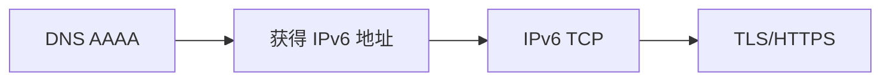

## 问题的起源

使用了sing-box代理后，微信等大陆连接在WiFi下会卡壳，发现多处sing-box日志Error。经过一番排查，问题锁定在DNS查询的位置。

## 现象

在同一个 Wi‑Fi（OpenWrt）下：

- Windows 可以正常查询域名的 `AAAA` 记录；

- OPPO 手机可以查询 `A` 记录；

- OPPO 使用当前的 `nslookup` 查询 `AAAA` 记录时失败；即使明确指定路由器 DNS、223.5.5.5 或 1.1.1.1，结果也一样；

- 路由器上tcpdump抓包时，`AAAA` 查询没有离开 OPPO 手机；

- OPPO 可以 ping 已知 IPv6 地址，但在 `testipv6.cn` 的测试中失败。

已确认：Private DNS 未启用；关闭路由HomeProxy 后现象仍存在。

## 最有价值的证据：先抓包，再判断责任边界

在 OpenWrt 上只观察手机的 DNS 流量：

```sh

tcpdump -ni br-lan -vv 'host <OPPO 的 IPv4 地址> and port 53'

```

然后在手机上IP Tools分别执行：

```sh

nslookup -type=A www.sina.com.cn

nslookup -type=AAAA www.sina.com.cn

```

本次观察结果是：A 查询有 DNS 报文，AAAA 查询没有对应报文。因此故障点位于**手机产生 DNS 请求之前**；至少可以先排除：

- OpenWrt 的 DNS 转发/拦截；

- 上游 DNS 对 AAAA 的返回；

- HomeProxy；

- 单纯更换 DNS 服务器能够解决的问题。

这一层面的结论比“查询失败”本身更可靠：没有请求离开终端，上游自然无从修复。

## 学到的几件事

### 能 ping IPv6 地址，不等于 AAAA 解析正常

直接 ping 一个 IPv6 字面量，只验证 IPv6 地址、路由和 ICMPv6 的一部分链路；它绕过了 DNS。访问 IPv6 网站则还依赖：



因此“IPv6 地址可 ping”与“IPv6 网站测试失败”并不矛盾。

## 相关命令备忘

```sh

# OpenWrt：只抓某个IP的普通 DNS 流量

tcpdump -ni br-lan -vv 'host <OPPO_IP> and port 53'

```

另，国内一个很好的测试ipv6的网站 https://testipv6.cn/

#sing-box #ipv6 #nslookup
