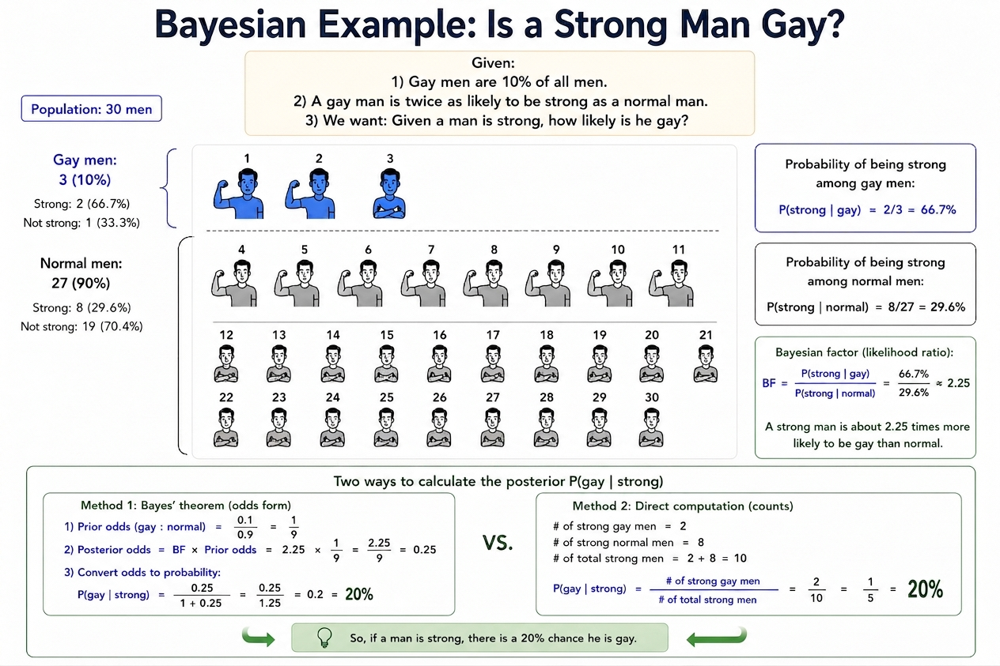

## 核心公式

贝叶斯定理描述了如何根据新证据更新我们的信念[^1][^2]：

$$
P(H|D) = \frac{P(D|H) \times P(H)}{P(D)}
$$

其中：

- **P(H)**：先验概率（观察证据前的信念）
- **P(D|H)**：似然函数（假设成立时观察到证据的概率）
- **P(H|D)**：后验概率（观察证据后更新的信念）
- **P(D)**：边际概率（证据的总概率）

## 贝叶斯因子：更直观的假设比较

贝叶斯因子（Bayes Factor）是两个假设的比，也就是所谓的**似然比**：

$$
BF_{12} = \frac{P(D|H_1)}{P(D|H_2)}
$$

**关键洞察**：后验赔率可以通过先验赔率乘以贝叶斯因子得到，无需计算全概率 P(D)：

$$
\frac{P(H_1|D)}{P(H_2|D)} = \frac{P(H_1)}{P(H_2)} \times BF_{12}
$$

## 直观例子：Gay问题

### 已知条件

- Gay占所有男人的 **10%**
- Gay是肌肉男的概率是普通男人的 **2.25倍**

### 具体数据（30人样本）

| 类别 | 人数 | 肌肉男人数 | 肌肉男概率 |
|------|------|----------|----------|
| Gay | 3人 | 2人 | **66.7%** |
| 普通男人 | 27人 | 8人 | **29.6%** |

### 贝叶斯推理过程

**问题**：当我们观察到一个肌肉男时，他是Gay的概率是多少？

**计算方法一：直接数人头**

$$
P(\text{Gay}|\text{肌肉男}) = \frac{\text{Gay的肌肉男}}{\text{肌肉男总数}} = \frac{2}{10} = 20\%
$$

**计算方法二：贝叶斯公式**

已知：

- $P(\text{Gay}) = 10\% = 0.1$（先验概率）
- $P(\text{肌肉男}|\text{Gay}) = \frac{2}{3} = 66.7\%$（Gay中肌肉男的概率）
- $P(\text{肌肉男}|\text{普通}) = \frac{8}{27} = 29.6\%$（普通男人中肌肉男的概率）

计算全概率 $P(\text{D})$，也叫归一化参数：

$$
P(\text{肌肉男}) = P(\text{肌肉男}|\text{Gay}) \times P(\text{Gay}) + P(\text{肌肉男}|\text{普通}) \times P(\text{普通})
$$

$$
= \frac{2}{3} \times 0.1 + \frac{8}{27} \times 0.9 = \frac{2}{30} + \frac{7.2}{27}  = \frac{1}{3}
$$

此处相当于加权汇总，肌肉男的出现平均机会是1/3。

代入贝叶斯公式：

$$
P(\text{Gay}|\text{肌肉男}) = \frac{P(\text{肌肉男}|\text{Gay}) \times P(\text{Gay})}{P(\text{肌肉男})} = \frac{\frac{2}{3} \times 0.1}{\frac{1}{3}} = 20\%
$$

**计算方法三：贝叶斯因子**

$$
BF = \frac{P(\text{肌肉男}|\text{Gay})}{P(\text{肌肉男}|\text{普通})} = \frac{66.7\%}{29.6\%} = 2.25
$$

后验赔率计算：

$$
\frac{1}{9} \times 2.25=\frac{1}{4}
$$

1：4对应的概率就是1/5，也就是20%

## 关键洞察：概率的相对变化

| 概率类型 | 值 | 说明 |
|----------|-----|------|
| 先验概率 P(Gay) | **10%** | 观察前的信念 |
| 后验概率 P(Gay|肌肉男) | **20%** | 观察到肌肉男后的更新 |

### 贝叶斯更新的意义

1. **概率翻倍**：从10%提升到20%，"肌肉男"证据让Gay的可能性**提升了2倍**
2. **基数效应**：由于Gay本身很少（10%），即使后验概率翻倍，绝对值仍然不高

## 避免基础率谬误

这个例子展示了**基础率谬误**（Base Rate Fallacy）：

- **错误思维**：Gay里面肌肉男概率高（66.7%），所以肌肉男很可能是Gay
- **正确思维**：虽然Gay里面肌肉男概率高，但Gay基数太小，所以肌肉男中Gay比例仍然较低

## 总结

贝叶斯定理的核心是**信念更新**：

1. 从先验概率开始
2. 根据观察到的证据（似然函数）
3. 更新为后验概率

#数学 #统计学

[^1]: Tom Chivers. (2023). _Everything is Predictable: How Bayesian Statistics Explain Our World_. Profile Books.
[^2]: Will Kurt. (2019). _Bayesian Statistics the Fun Way_. No Starch Press.
